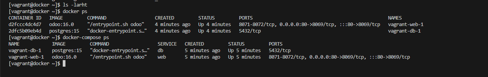
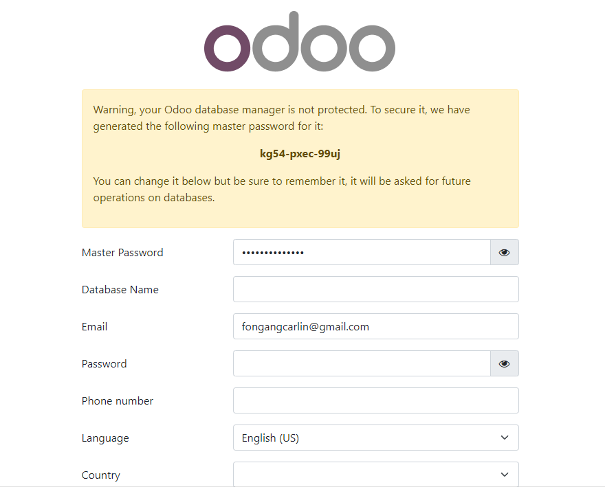

# Deployment of 2 container with odoo front and postgresql

------------

Firstname : Carlin

Surname : FONGANG

Email : fongangcarlin@gmail.com

For Eazytraining's 17th DevOps Bootcamp

Period : January at March 2024

Sunday the 14th, march 2023


 
LinkedIn : https://www.linkedin.com/in/carlinfongang/


==============
## Deploy of odoo ERP 

### Download and install Compose
````
curl -SL https://github.com/docker/compose/releases/download/v2.23.3/docker-compose-linux-x86_64 -o /usr/local/bin/docker-compose
````

### Permission d'exécution sur le binaire
````
 sudo chmod +x /usr/local/bin/docker-compose 
````

### vérification de la version de docker compose
````
docker-compose -v
````

### définition du fichier secret pour le mot de passe de la bd
````
touch $PWD/odoo_pg_pass
echo "odoo" > odoo_pg_pass
````

### création du repertoire de stockage, remplacer et sauvegarde de mot de passe bd
````
sudo mkdir /home/$USER/odoo_pg_pass
sudo mkdir /run/secrets/postgresql_password
````


### lancement de docker compose pour le déploiement des conteneurs odoo et postgre ainsi que du réseau, la description de l'infra et config dans le fichier docker_compose.yml
````
docker compose -f docker_compose.yml up -d
````


### check running odoo and postgresql
````
docker-compose ps
````


### launch Odoo ui
````
http://<IP_ADDRESS:8081
````
